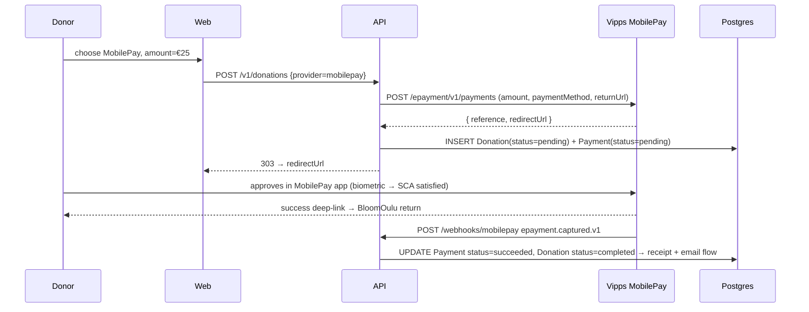
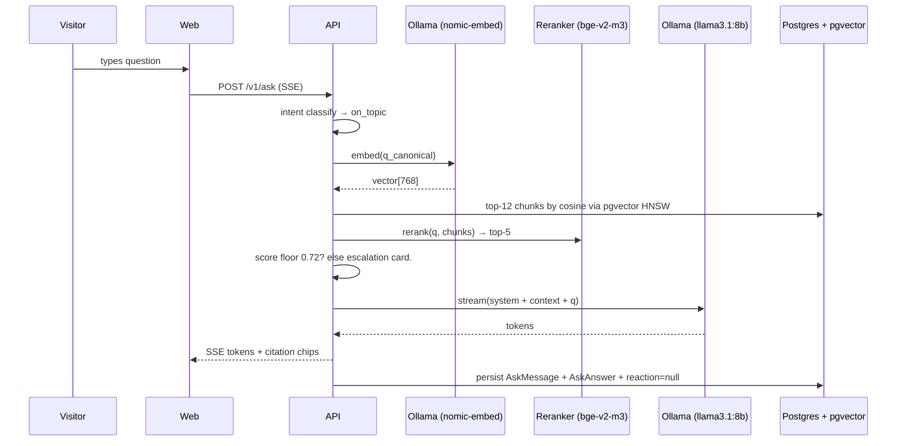
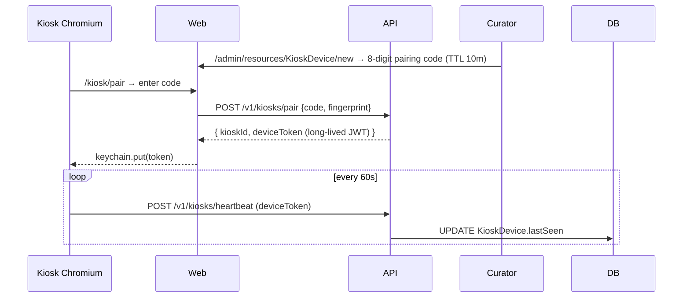

# BloomOulu — System Design

**Audience:** Engineers, ops, finance, future maintainers at the University.
**Status:** Living document. Edit alongside ADRs.

## 1. System context

```mermaid
flowchart LR
  V[Visitor's phone] -->|HTTPS / RSC| W[Next.js Web]
  K[Greenhouse kiosk] -->|HTTPS / SW| W
  C[Curator / Staff] -->|OIDC or magic link| ADM[AdminJS]
  W -->|REST + RSC| A[NestJS API]
  ADM --> A
  A --> DB[(Postgres 16 + pgvector)]
  A --> R[(Redis 7 + BullMQ)]
  A --> S3[(MinIO)]
  A -->|HTTPS| PT[Paytrail]
  A -->|HTTPS| MP[Vipps MobilePay]
  A -->|HTTPS| O[Ollama LLM + embeddings]
  A -->|SMTP| Mail[Postal SMTP]
  PT -->|webhook| A
  MP -->|webhook| A
  Bank[Garden's bank<br/>(camt.054 CSV)] --> ADM
  A -->|OTLP| OBS[Prometheus / Grafana / Loki / Tempo]
  A -->|HTTP push| NT[ntfy.sh alerts]
```

Everything runs in one `docker compose up` on a single Hetzner-class VPS
(see ADR-0001). No SaaS dependencies; per-transaction payment fees only
when Paytrail / MobilePay are enabled.

## 2. Service map

| Service | Repo path | Runtime | Notes |
|---|---|---|---|
| **web** | `apps/web` | Next.js 15 (App Router + RSC + Server Actions) | Public site at `bloomoulu.fi`. ISR + on-demand revalidation. |
| **api** | `apps/api` | NestJS 10 + Fastify | REST API at `api.bloomoulu.fi`. OpenAPI exported at `/docs` in built mode. |
| **workers** | `apps/api` (same image, `pnpm worker` entrypoint) | BullMQ workers | Single host in year-1; horizontal-scalable behind the same Redis. |
| **admin** | `apps/admin` | AdminJS 7 + Fastify | `admin.bloomoulu.fi`. IP-allowlisted at Caddy in production. |
| **kiosk** | `apps/kiosk` | Next.js standalone | `kiosk.bloomoulu.fi`. Paired via 8-char code; long-lived JWT in keychain. |
| **db** | `infra/postgres` | Postgres 16 + pgvector | Single instance; daily encrypted backups + WAL archiving. |
| **redis** | included container | Redis 7 | BullMQ + cache. |
| **storage** | `infra/minio` | MinIO | S3 API. Bucket `bloomoulu-assets` for receipts, tax certs, GDPR exports. |
| **email** | `infra/postal` (prod) / MailHog (dev) | Postal SMTP / MailHog | Transactional only. |
| **llm** | `infra/ollama` | Ollama + llama3.1:8b + nomic-embed-text:v1.5 + bge-reranker-v2-m3 | RAG entirely local; no data leaves the VPS. |
| **observability** | LGTM stack | Prometheus / Grafana / Loki / Tempo | Self-hosted; dashboards in `infra/grafana/dashboards/`. |
| **errors** | GlitchTip | Sentry-API-compatible | FOSS. |
| **alerts** | ntfy.sh | Self-hosted | Curator + ops phones. |
| **backups** | `restic` to MinIO + offsite | | Daily; tested restore (target RTO 30 min, see ADR-0009). |

## 3. Critical sequences

### 3.1 Donor donates via bank transfer (zero-fee default rail)

```mermaid
sequenceDiagram
  participant D as Donor (phone)
  participant W as Web (Next.js)
  participant A as API (NestJS)
  participant DB as Postgres
  participant Bank as Bank app
  participant Acc as Accountant
  participant Q as BullMQ
  participant Mail as Postal SMTP

  D->>W: GET /fi/donate?plant=pulsatilla-patens
  W-->>D: SSR donate form
  D->>W: POST donate (form action)
  W->>A: POST /v1/donations {preferredProvider: bank_transfer}
  A->>DB: INSERT Donation(status=pending) + Payment(status=pending, orderId=UUIDv7)
  A->>A: generate RF Creditor Reference from orderId
  A-->>W: 303 → /fi/donate/pay?orderId=…&amount=…&ref=RF22+…
  W-->>D: SSR instructions page (IBAN + BIC + RF + EPC069-12 QR)
  D->>Bank: scan QR or paste RF
  Bank-->>D: confirm payment

  Note over Acc: Daily / weekly
  Acc->>W: /admin/pages/reconciliation → upload camt.054 CSV
  W->>A: POST /v1/reconciliation/entries [{ref, amount, paidAt, bankRef}]
  A->>A: parse RF → resolve UUIDv7 orderId
  A->>DB: $transaction:
    - INSERT ProcessedEvent (UNIQUE gate)
    - UPDATE Payment status=succeeded
    - UPDATE Donation status=completed
    - INSERT AuditLog rows
    - if donation.plantId: increment Plant.donorCount
  A->>Q: enqueueReceipt {paymentId}
  Q-->>A: receipt worker:
    - nextReceiptNumber() → BLO-2026-000001
    - renderReceiptPdf via @react-pdf/renderer
    - uploadToS3 → s3://bloomoulu-assets/receipts/BLO-2026-000001.pdf
    - UPSERT Receipt
    - enqueueEmail
  Q-->>A: email worker:
    - presign s3:// → 24h URL
    - renderMjml + interpolation
    - nodemailer → Postal SMTP
  Mail-->>D: Receipt PDF attached, sha256 logged.
```

Recovery rules:

- Re-submitting the same camt.054 row → matched=false, reason=already_processed (idempotent at both lookup + ProcessedEvent UNIQUE).
- Amount mismatch → flagged manually; not auto-succeeded.
- Worker DLQ retains failed jobs 30 days for admin replay.

### 3.2 Donor donates via Paytrail (cards, FI banks, Apple/Google Pay)

```mermaid
sequenceDiagram
  participant D as Donor
  participant W as Web
  participant A as API
  participant PT as Paytrail
  participant DB as Postgres

  D->>W: POST donate {preferredProvider: paytrail}
  W->>A: POST /v1/donations
  A->>PT: POST /payments (line_items, redirectUrls, callbackUrls,
                         HMAC-SHA256 over canonical checkout-* + body)
  PT-->>A: { transactionId, hostedPaymentUrl, providers[] }
  A->>DB: INSERT Donation + Payment(provider=paytrail, status=pending)
  A-->>W: 303 → Paytrail hosted page
  D->>PT: pick rail (card / Nordea / OP / ...) → 3DS or bank auth
  PT-->>D: success → return_url to bloomoulu.fi
  PT->>A: POST /webhooks/paytrail (signed)
  A->>A: verify HMAC over raw body + checkout-* headers
  A->>DB: $transaction:
    - INSERT ProcessedEvent
    - UPDATE Payment status=succeeded
    - UPDATE Donation status=completed
    - enqueueReceipt (post-commit)
```

### 3.3 Donor donates via Vipps MobilePay (one-time)



MobilePay donations are one-time: there is no agreement, renewal cron, or
dunning ladder. An abandoned approval simply leaves the `Donation` pending.

### 3.4 AskTheGarden RAG chat (entirely local LLM)



### 3.5 Kiosk pairing + heartbeat



If `lastSeen > now - 5m` the kiosk-watchdog cron fires a P1 ntfy
notification. Local hardware watchdog reboots into the locked Chromium
profile after 3 min of healthcheck failure.

### 3.6 Favourite a plant (anonymous vote)

The Favourite button on a plant page calls `POST /v1/plants/:slug/vote`
(and `DELETE` to un-favourite). Votes are idempotent, keyed on a salted
hash of the visitor's IP + User-Agent — no account and no PII. The
denormalised `Plant.voteCount` is updated in the same transaction.
`GET /v1/votes/leaderboard` powers the public `/favourites` page.

## 4. Data flow: webhook → receipt

```
Paytrail webhook ─ HTTP ─►  /webhooks/paytrail  ─┐
                                                  │
MobilePay webhook ─ HTTP ─► /webhooks/mobilepay  ─┤
                                                  ├─►  PaymentsService.handleEvent
Bank-transfer entry ──────► /v1/reconciliation/  ─┘     (idempotent, txn-wrapped)
                                                       │
                                                       ▼
                                  UPDATE Payment + Donation inside $transaction
                                                       │
                                                       ▼
                                  (post-commit) enqueueReceipt
                                                       │
                                                       ├──► render PDF (@react-pdf)
                                                       ├──► uploadToS3 (MinIO)
                                                       ├──► UPSERT Receipt
                                                       └──► enqueueEmail
                                                                  │
                                                                  ▼
                                                          presign s3:// → 24h URL
                                                          render MJML + interpolation
                                                          nodemailer → Postal SMTP
```

## 5. Failure modes

| Failure | Detection | Response |
|---|---|---|
| Paytrail webhook flood | `webhook.received` Prom counter > 10× normal | rate limit per-IP, alert ops; idempotency gate absorbs duplicates |
| Paytrail outage | health probe failure on the merchant API | display banner "Card payments temporarily unavailable, try MobilePay or bank transfer"; mobilepay + bank_transfer rails unaffected |
| Vipps outage | health probe failure | new payments queue; donor sees retry hint |
| pgvector latency spike | OTEL p95 > 200ms | warm Redis cache, alert; fall back to keyword search on Plant slug + nameEn |
| Ollama outage | provider 5xx > 3 in 60s | escalation card "We'll get back to you" + queue question + curator notify |
| MinIO down | upload error | Receipt PDF job retries via BullMQ DLQ; admin can replay; donor sees the receipt number in the email, PDF link goes live when MinIO returns |
| Bank-transfer mismatch | reconciliation result amount_mismatch | flagged in admin UI; not auto-succeeded |
| Disk filling | Prom rule on `node_filesystem_avail_bytes / total` < 20% | P1 ntfy to ops |
| Cert near expiry | Prom rule on Caddy cert | P2 ntfy 14d before |

## 6. Capacity (year 1)

Pitch targets: 100 donors by month 12, ~€9k revenue, 30k web visitors annual, 7 plant-page views per visit.

- 30k × 7 = ~210k plant-page views/year ≈ 600/day average, ~10k/day peak on press days.
- 1.5 RPS average, ~30 RPS peak — comfortable on a 4-core / 8 GB Hetzner CX22.
- pgvector: ~10k chunks, HNSW index, p95 retrieval < 50ms.
- Storage: audio 24 narrations × 3 langs × ~500 KB = 36 MB. Plant photos ~30 MB. Receipt PDFs (~200/year × 100 KB) = 20 MB.

We provision for ×10 these numbers and still stay under €15/month total ops cost (single VPS).

## 7. Stale-doc note

This document was rewritten on 2026-05-14 to match the actual architecture
(Hetzner self-hosted + Paytrail + MobilePay + bank transfer + Ollama).
Prior versions referenced Vercel + Fly.io + Stripe + Mistral; those choices
were retired in favour of the FOSS, single-VPS, EU-only constraints set in
ADR-0001. See ADR-0004 (superseded) → ADR-0011 (current) for the payment
rail evolution.

Updated 2026-06-17: the adopt-a-plant tier model (tiers, perks, plaques,
recurring billing, gift codes, dunning) was replaced by one-time donations
+ a favourites/votes leaderboard. The three payment rails are unchanged but
now process one-time payments only.

## 8. Open questions (for the University + Garden)

1. **Accession DB** — is there a documented export endpoint, or do we run a Postgres FDW directly into the University DB? (Affects the catalogue sync job.)
2. **Phenology log format** — Markdown in Git? Notion? Airtable? Affects the curator's daily workflow.
3. **Photography release** — every staff/curator photo on the donor dinner page needs a written release. Template in `docs/legal/photo-release.md`.
4. **DPO contact** — currently a placeholder in `legal.privacy` (dpo@oulu.fi). Confirm with the University DPO office.
5. **Garden IBAN** — `bankTransfer.iban` setting is `FI00 0000 0000 0000 00`. Replace before first real donation.
6. **MobilePay merchant onboarding** — pending; ~2 weeks KYC. Bank transfer + Paytrail are the day-1 launch surface.
