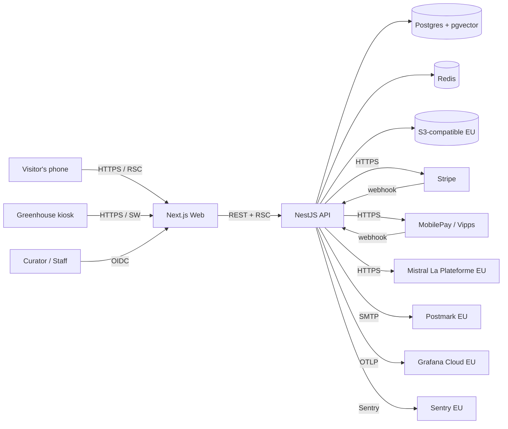
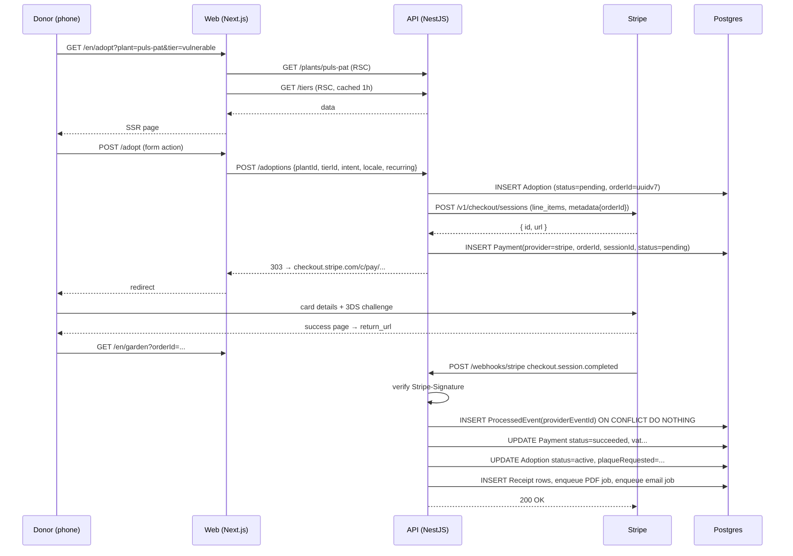
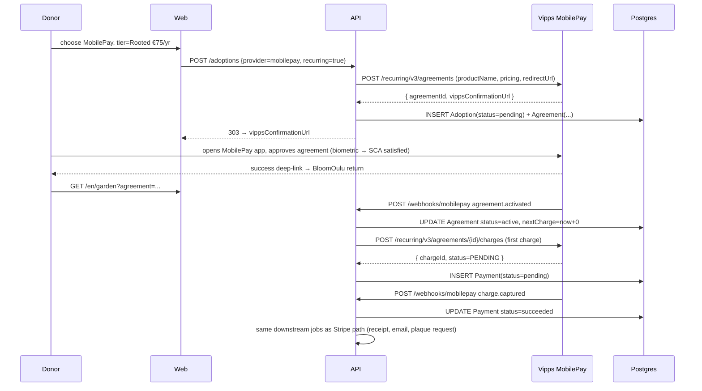
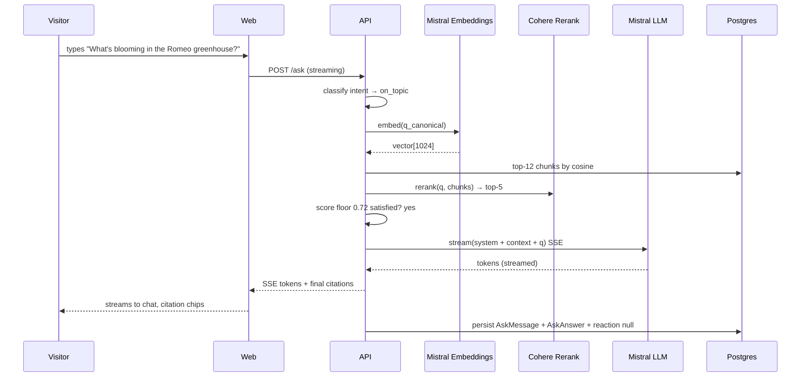
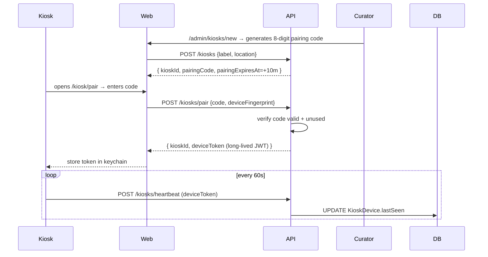

# BloomOulu — System Design

**Audience:** Engineers, ops, finance, future maintainers at the University.
**Status:** Living document. Edit alongside ADRs.

## 1. System context



## 2. Service map

| Service | Repo path | Runtime | Region | Scaling |
|---|---|---|---|---|
| **web** | `apps/web` | Next.js 15 on Vercel | fra1 (Frankfurt) | Auto (edge) |
| **api** | `apps/api` | NestJS 10 on Fly.io | arn (Stockholm) primary + hel (Helsinki) failover | 2 → 8 machines |
| **workers** | `apps/api` (same image, `JOBS=true`) | BullMQ workers | arn | 2 machines |
| **kiosk** | `apps/kiosk` | Next.js, served standalone on Fly.io | arn | 1 machine, fronted by HTTP cache |
| **db** | Neon serverless Postgres | fra1 | Neon-managed |
| **redis** | Upstash | fra1 | Upstash-managed |

## 3. Critical sequences

### 3.1 Donor adopts a plant via card (Stripe Checkout)



Recovery rules:

- Stripe will retry the webhook with exponential backoff for 3 days.
- If `ProcessedEvent` exists, we return 200 immediately (idempotent).
- If we 500, Stripe retries. Our SLO: webhook processing < 500ms P95.

### 3.2 Donor adopts via MobilePay (recurring annual)



Yearly renewal: a cron worker scans `Agreement.nextCharge <= now()` and issues the next charge. Failures (insufficient funds) move the agreement to `failed` and trigger a `dunning` flow (3 retries over 14 days, then cancel + notify).

### 3.3 AskTheGarden question



### 3.4 Kiosk pairing + heartbeat



If `lastSeen > now - 5m`, ops gets a Slack alert. The kiosk has a hardware watchdog: if its own healthcheck fails for 3 min, it reboots into a kiosk-locked Chromium.

## 4. Data flow: webhook to receipt

```
Stripe webhook  ── HTTP ──►  /webhooks/stripe  ─┐
                                                 │
MobilePay webhook ─ HTTP ─►  /webhooks/mobilepay ┴►  PaymentEventsHandler
                                                       │
                                                       ▼
                                            UPDATE Payment (txn)
                                                       │
                                                       ▼
                                           enqueue ReceiptJob
                                                       │
                                                       ├──► render PDF (react-pdf)
                                                       ├──► upload S3 EU
                                                       ├──► UPDATE Receipt.pdfUrl
                                                       └──► enqueue EmailJob
                                                                  │
                                                                  ▼
                                                          Postmark → donor
```

## 5. Failure modes

| Failure | Detection | Response |
|---|---|---|
| Stripe webhook flood | `webhook.received` Prom counter > 10× normal | rate limit per-IP, alert ops |
| Stripe outage | Stripe status page subscription | display banner "Bank payments slow"; fall back to MobilePay-only UI |
| MobilePay outage | health probe failure | display "MobilePay temporarily unavailable, try card"; surface kiosk fallback to ticket-hall donations |
| pgvector latency spike | OTEL p95 > 200ms | warm Redis cache, alert; fall back to keyword search |
| Mistral outage | provider 5xx > 3 in 60s | escalation card "We'll get back to you" + queue question |
| Audio asset CDN slow | client-reported error | switch to direct S3 URL with signed token |

## 6. Capacity (year 1)

Pitch targets: 100 adopters by month 12, ~€9k revenue, 30k web visitors annual, 7 plant-page views per visit.

- 30k × 7 = ~210k plant-page views/year ≈ 600/day average, ~10k/day peak on press days.
- 1.5 RPS average, ~30 RPS peak — comfortable on a 2-core Fly.io machine.
- pgvector: ~10k chunks, HNSW index, p95 retrieval < 50ms.
- Storage: audio 24 narrations × 3 langs × ~500KB = 36MB. Plant photos ~30MB. Receipt PDFs (estimated 200/year × 100KB) = 20MB.

We provision for ×10 these numbers and still stay under €120/month total ops cost.

## 7. Open questions (for the University + Garden)

1. **Accession DB** — is there a documented export endpoint, or do we run a Postgres FDW directly into the University DB? (Affects the catalogue sync job.)
2. **Phenology log format** — Markdown in Git? Notion? Airtable? Affects the curator's daily workflow.
3. **Photography release** — every staff/curator photo on the donor dinner page needs a written release. Template in `docs/legal/photo-release.md`.
4. **DPO contact** — published in `/privacy` per GDPR Art. 13. Currently TBD.
